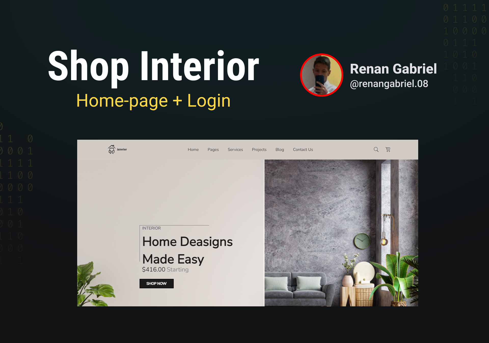
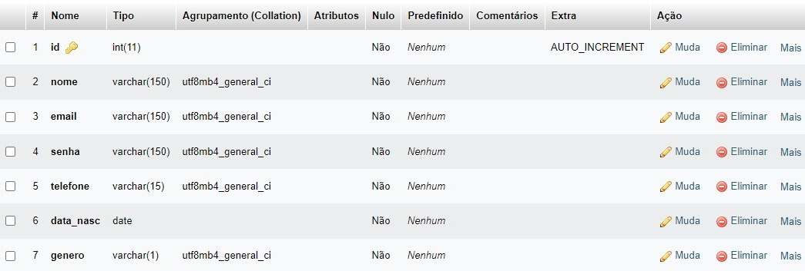

<h1 align="center"> Sistema Funcional de Login e Registro </h1>

Um site de uma loja vendedora de produtos para o interior de sua residência com home-page e um sistema funcional de login e registro de contas em um banco de dados localhost.

  <a href="#-tecnologias">Tecnologias</a>&nbsp;&nbsp;&nbsp;|&nbsp;&nbsp;&nbsp;
  <a href="#-projeto">Projeto</a>&nbsp;&nbsp;&nbsp;|&nbsp;&nbsp;&nbsp;
  <a href="#-programas">Programas</a>&nbsp;&nbsp;&nbsp;|&nbsp;&nbsp;&nbsp;
  <a href="#-banco-de-dados">Banco de Dados</a>&nbsp;&nbsp;&nbsp;|&nbsp;&nbsp;&nbsp;
  <a href="#-customização">Customização</a>&nbsp;&nbsp;&nbsp;|&nbsp;&nbsp;&nbsp;
  <a href="#-layout">Layout</a>&nbsp;&nbsp;&nbsp;|&nbsp;&nbsp;&nbsp;
  <a href="#memo-licença">Licença</a>

  

 

  

## 🚀 Tecnologias

Esse projeto foi desenvolvido com as seguintes tecnologias:

- HTML e CSS
- SASS
- JavaScript
- PhP
- MySQL
- Git e Github

## 🖥️ Projeto

Este projeto foi desenvolvido em férias a fins de estudo, para aprimorar habilidades no front-end e iniciar estudos com banco de dados.

## 🗂️ Programas

Para executar o programa e sistema de login é necessário:

- Baixar e instalar Xampp através [DESSE LINK](https://www.apachefriends.org/pt_br/download.html)
- Iniciar Apache e MySQL
- Criar banco de dados através [DESSE LINK](http://localhost/phpmyadmin/)
- Utilizar as configurações a seguir para o banco e dados

## 🗄️ Banco de Dados

Configurações básicas para a criação e funcionamento do banco de dados:

- Nome do Banco de Dados: formulario-teste
- Nome da tabela: usuarios
- Numero de colunas: 7
- Configurações da Coluna

  

## 📝 Customização

Constomisações básicas para alteração de código:

- Alterar as áreas em comentário no arquivo config.php para suas configurações

## 🔖 Layout

Você pode visualizar o layout inicial do projeto através [DESSE LINK](https://www.figma.com/file/OpfBN3tvlc3dJFteIVghz0/interior-design?node-id=35%3A1017&t=6oNfQki6Pjf4kyU2-0). É necessário ter conta no [Figma](https://figma.com) para acessá-lo.

## :memo: Licença

Esse projeto está sob a licença MIT.

---

- Código desenvolvido por Renan :wave: [LinkedIn](https://www.linkedin.com/in/renan-gabriel/) | [Github](https://github.com/renangabriel08)